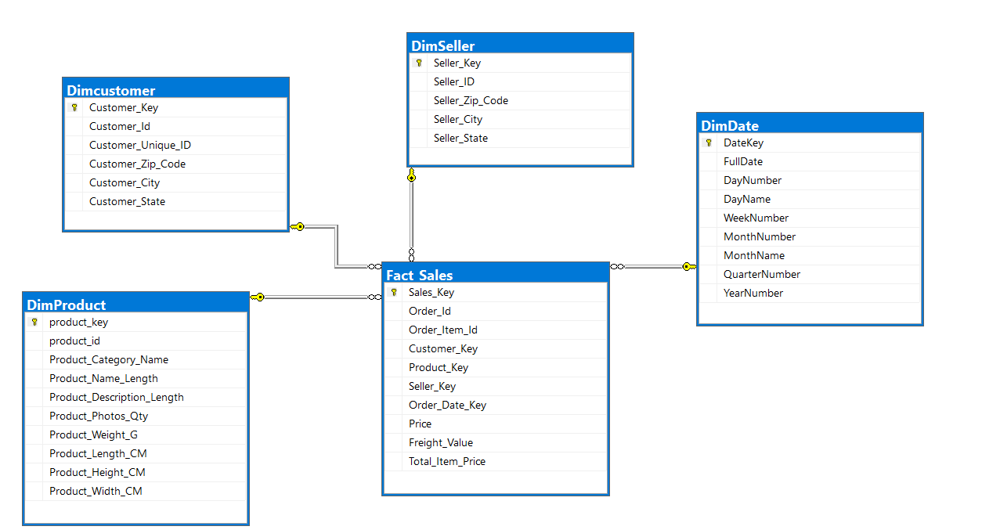

# Olist Data Warehouse

An end-to-end data warehouse project built on the [Olist Brazilian E-Commerce dataset](https://www.kaggle.com/datasets/olistbr/brazilian-ecommerce), using **Python, SQL Server, Docker, Apache Airflow, and Power BI**.

The dataset contains e-commerce **sales and orders** data. The goal of the project is to clean this raw data, enrich it, store it in a structured data warehouse, automate the whole process, and visualize the results in Power BI.

## Architecture



## What I Did

1. **Data cleaning:** cleaned the raw sales and orders data using Python.
2. **Feature engineering:** created new calculated columns to support analysis.
3. **Data warehouse:** loaded the cleaned data into a data warehouse on SQL Server.
4. **Automation:** orchestrated the pipeline with Apache Airflow so it runs automatically.
5. **Containerization:** packaged everything with Docker so the project runs the same on any machine.
6. **Reporting:** built Power BI dashboards on top of the warehouse.

**Flow:** Raw data -> Python ETL (clean and transform) -> SQL Server data warehouse -> Power BI dashboards, all orchestrated by Airflow and running in Docker.

## Data Model

The warehouse follows a **star schema**:

| Type | Tables |
|------|--------|
| Fact table | `Fact_Sales` |
| Dimension tables | `Dim_customers`, `Dim_Products`, `Dim_Sellers`, `Dim_Date` |
| Reporting views | `vw_MonthlySales`, `vw_CategoryRevenue`, `vw_category_sales`, `vw_top_customers`, `vw_sels_state` |

The reporting views prepare aggregated data (monthly sales, revenue by category, top customers, sales by state) for Power BI.

## Tech Stack

| Tool | Usage |
|------|-------|
| Python | ETL scripts (extract, transform, load) |
| SQL Server | Data warehouse storage |
| Apache Airflow | Pipeline orchestration and scheduling |
| Docker / Docker Compose | Containerized, reproducible environment |
| Power BI | Dashboards and reporting |

## Project Structure

```
Olist-Data-Warehouse/
├── Sql/                  # SQL scripts
├── airflow/              # Airflow DAGs and config
├── config/               # Project configuration
├── etl/                  # Python ETL code
├── main/                 # Entry point
├── Dockerfile
├── docker-compose.yml
├── requirements.txt
└── DW_Diagram_Project.png
```

<!-- TODO: add one short line per folder explaining what is inside. -->

## Getting Started

### Prerequisites
- Docker and Docker Compose
- The Olist dataset (CSV files) downloaded from Kaggle

### Run

```bash
git clone https://github.com/Mohamed-Abdelkader5/Olist-Data-Warehouse.git
cd Olist-Data-Warehouse
docker compose up -d --build
```

<!-- TODO: confirm these commands work, then add: where to put the CSV files, the Airflow URL (e.g. http://localhost:8080), and how to trigger the DAG. -->

## Dashboard

The Power BI report (3 pages) is built on top of the warehouse.

**KPIs:** total customers, total orders, total sales, average order value, and average delivery days.


**Sales analysis:** sales by product category, customer, city, and year/month.


## Author

**Mohamed Abdelkader El-Sayed**
Computer and Data Science, Alexandria University (2027)

[LinkedIn](https://www.linkedin.com/in/mohamed-abdelkader-214227323/) | [GitHub](https://github.com/Mohamed-Abdelkader5)
